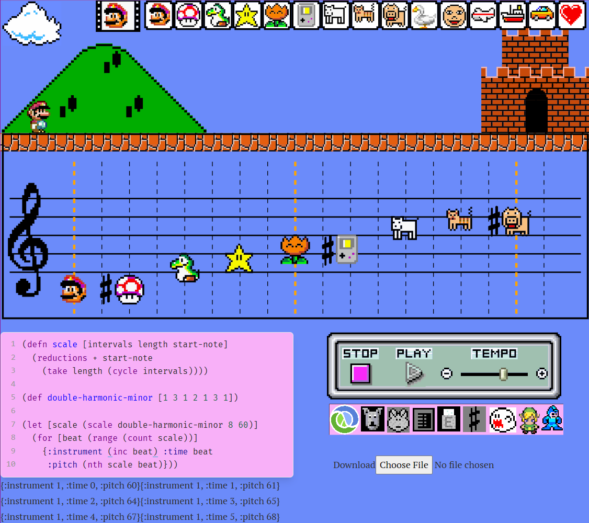

# MECCA Music Platform

The Music Education, Composition, Creation Application

MECCA is a sample-based music editor inspired by Mario Paint written in Clojurescript and re-frame.

It was originally meant to be a chiptune tracker that would simply emulate the 4 channels of the NES. But then I started playing around with alternative interfaces and while working on an SVG music notation rendering engine I realized that my priorities were definitely out of whack, and what my program really needed was a jumping Mario and animal noises.

I found that the specific subset of musical features used in the Mario Paint music maker provides a delightful scope of creative possibilities while remaining very approachable. And by using distinctively styled note heads that play samples of a common length, a whole set of elements to implement goes away, like rests, stems, beams, and the need for multiple staves for each voice. Besides providing a more quickly acheivable development path, this choice burdens a new music student with less advanced music theory from the start, making for a more compact interface where the composition can be tracked without any mental context switching.

Check out the inspiring paper [Mario Paint: An Accessible Environment of Musical Creativity
and Sound Exploration](docs/Mario_Paint_An_Accessible_Environment_of.pdf).

[Live app in its current state](https://BTowersCoding.github.io/mecca/)



I ended up getting a bit carried away with the pixel art, after trying every SVG tool I could find I was still unsatisfied with the results, so ended up coding it all by hand as basic lines, shapes and paths. For example, the [castle](https://github.com/porkostomus/mecca/blob/master/src/mecca/castle.cljs) in the picture above is actually a function that outputs staggered rows of dashed lines representing bricks and mortar organized in a [stretcher bond](https://en.wikipedia.org/wiki/Brickwork#Stretcher,_or_running_bond) masonry pattern. And that Mario is not even a sprite - he's a group of vector paths connected to form his limbs, hat and [moustache](https://laughingsquid.com/origin-of-marios-mustache-and-his-name/). And once this app blows up and I get sued by Nintendo, a new version will be out with a character called *Mr. Moustache*, who will in fact be nothing more than a bouncing moustache on a stick with a red hat on.

The EDN code representing your music data is output below Data-Robot. It's a sequence of Clojure maps, one for each note. Copy and paste into your favorite text editor to save your composition. Actual save function coming soon.

## Progress

Implemented [Undodog](https://www.mariowiki.com/Undodog) and Redo-Rabbit. The second one I made up. Actually I think it's supposed to be a frog but that's neither a pun nor alliterative so whatevs. It was a highly emotional fight between Redo-Robot, Redo-Wombat and Redo-'rangutan for the position, but the frog thing won out due to ~~me not having to design another button~~ seniority.

Added a sharp button, expanding it to all 12 chromatic tones. Editor scrolls mostly right. Animation... not so much. While it might be reasonable to place visual elements at a lower priority than the app's audio scheduling system, they are closely related since both deal with coordination of time and reaction to events.

Update:

You can now play the Mario sampler as a live instrument using the keyboard in 2 full octaves, following the common "virtual piano" configuration:

```
 2 3     5 6 7
q w e r t y u i
 a s    g h j
z x c v b n m ,
```

Currently working on parsers for import/export of various music formats, including (but not limited to):

* MusicXML
* MIDI
* ABC
* MEI
* NSF (NES Sound Format)
* SID (C64)

## Future ideas

It would be cool to be able to record, link or upload your own samples. However, when [Koji Kondo](https://en.wikipedia.org/wiki/Koji_Kondo) said that composing for the SNES is 1000 times harder than composing for the NES<sup>[[citation needed - discuss](https://github.com/porkostomus/mecca/wiki/Where-the-%23%25%5E&-is-that-quote-from%3F)]</sup>, he was warning us about the *choose-a-phone* problem. Being sample based, the SNES can play any sound you throw at it, while the NES only plays one set of built-in sounds. See, once you have no idea what instrument you are composing for, all bets are off. The nature of art is defined at least in part by the limitations of the medium. 

As [Rich Hickey said](https://github.com/matthiasn/talk-transcripts/blob/master/Hickey_Rich/DesignCompositionPerformance.md), "no one wants to compose for a choose-a-phone ensemble".

See the paper, [Game Scoring: Towards a Broader Theory](/docs/game-scoring.pdf) for a fantastic treatment of the specific musical inventions that came about through creatively overcoming the technological limitations historically involved in the development of game music.

So how can we expand the sonic pallet without turning it into a choose-a-phone?

This question goes right to the heart of a creative platform's design philosophy, and mine is something like (to put it in one line): "to subtly encourage the use of effective idioms while maintaining maximal expressivity."

One idea is to make an 8-bit / 16-bit switch that will transform the whole UI respectively from synth oscillator to sample mode.

For the synths, I believe that by using the very efficient algorithms from Blargg's [blip-buf](https://github.com/nesbox/blip-buf) library, a full emulation can be done in the browser quite easily. Since the [NES APU](https://wiki.nesdev.com/w/index.php/APU) produces sound via a [sample/hold](https://en.wikipedia.org/wiki/Sample_and_hold) circuit, it is only necessary to generate the ends of the waveforms (the transitions) since the middle part is the same regardless of frequency, differing only in length.

* Noise channel produces pseudo-random bits by [linear feedback shift register](https://en.wikipedia.org/wiki/Linear-feedback_shift_register) method. This is then played back at 16 possible sample rates to produce hihats, snares and other percussive sounds. A much shorter bit sequence is also possible, which is perceived by the human cognitive auditory system as a metallic tone rather than noise due to its periodicity.

* The triangle channel (for bass and kick drums/toms) is actually a 16 step quantized triangle-ish wave with a slight shark fin shape that also has tiny sawteeth on it. Gotta get this stuff right. That's what gives the Nintendo basslines those really sweet whirling harmonic overtones. The waveform is actually produced by hijacking the channel's velocity control on the chip and using it as a 16-step counter. For this reason the bass channel has no adjustable velocity, notes are either _on_ or _off_.

* The 2 pulse-wave (lead) channels offer a variable duty cycle, so the standard Web Audio square wave will also not do here. However, we do have the option of using a wavetable, which can produce an arbitrary periodic waveform defined by a list of sin/cosine terms for the Fourier coefficients, which can be easily derived for any sound by playing it through the FFT provided by the Web Audio analyzer node.

* Linear-interpolated bandlimiting will be good enough, since we have the ability to use the hardware clock exposed by the Web Audio API to oversample at an extremely high rate, supressing aliasing far below perceptible limits.

Also very exciting is the possibility of an SVG pixel art / animation studio. Like the way it was in Mario Paint but more better because stuff like custom color pallets, upload your own coloring books, etc.

When I'm personally building a song with this, the biggest feature that I wish I could reach for is a kind of pattern looping system which would facilitate and encourage working with smaller sections to be composed via a "song" track, which could be as simple as `A B A B` or something. I'm going to look back to the tracker paradigm for inspiration here.

This is the perfect job for Data-Robot, who is currently just sitting there waiting to be put to use. His job is to be concerned with the loading and saving of song data, which can be further divided into:

* *Pattern data* - content to be looped, whether at the "beat" level i.e. drum/bass patterns, or the "song" level (verse/chorus).

* *Song data* - A "conductor" track listing the order of repetitions of the various loops, and

* *File data* - Load/save of entire song.

Then again, if I were to refine the editor scrolling experience by, for example, adding buttons to "page forward/back", or notational constructs for creating inline loops, working with the entire score at once might not feel so cumbersome.

Update: Added buttons for *measure forward* and *scroll to end*.

## Development

Do the thing:

```bash
$ npm install
added 97 packages from 106 contributors in 5.984s
```

Start the development process by running:

```bash
$ npx shadow-cljs watch app
...
[:app] Build completed. (134 files, 35 compiled, 0 warnings, 5.80s)
```

Or simply `jack-in` from your editor if you use CIDER/Emacs/Calva, etc. Your app will be served at: at [http://localhost:3000](http://localhost:3000).

## Production build

```bash
npx shadow-cljs release app
```

Thanks to [Bruce Hauman](https://github.com/bhauman), [Chris Ford](https://github.com/ctford) and [Dave Yarwood](https://github.com/daveyarwood) for blazing the CLJS Web Audio trail. No way could I have figured this all out myself.

## Funding

My greatest passion is making music with code, and I believe that there is a vital connection between these domains that is being missed in our educational culture. When the execution of a program results in a richer sensory experience, it facilitates an intuitive understanding of algorithms by engaging the student in a more tangible feedback loop. By teaching these disciplines together, it can unlock an appreciation and continued interest in each of them, and may result in more people building stuff we never thought possible! Sponsor me on [Patreon](https://www.patreon.com/porkostomus) to help me build software for music education.
